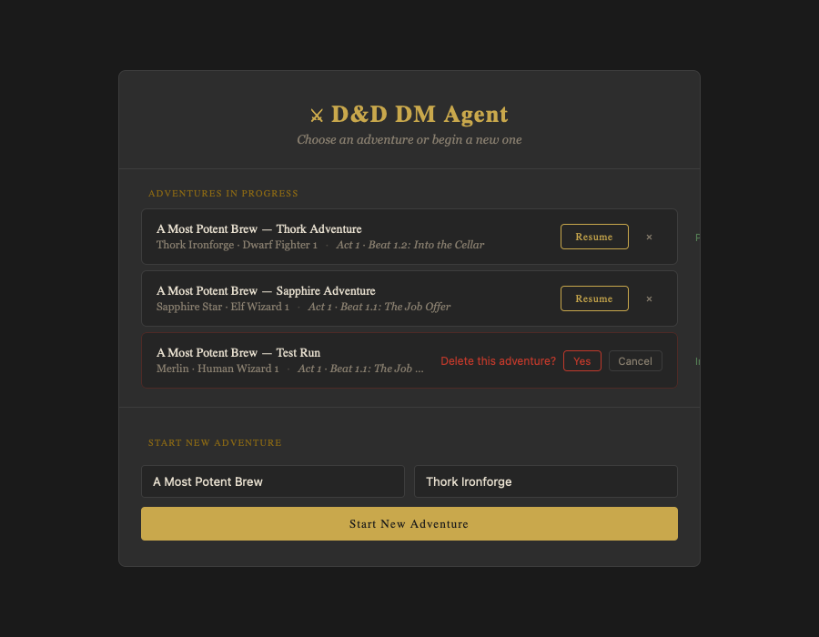

# ADR-012: Campaign Browser Frontend Design

## Status
Accepted

## Mockup



*Live mockup: [`docs/mockups/campaign-browser.html`](../../mockups/campaign-browser.html)*

## Context
The current `SessionSetup.tsx` is a centred card with two dropdowns (campaign, character) and a "Begin Adventure" button. It has no concept of in-progress vs new, no way to delete an instance, and no visual identity — it feels like a config form rather than a game entry point.

ADR-011 defined the CRUD model for campaign management. This ADR specifies how that model is expressed in the UI, within the existing dark fantasy aesthetic (CSS variables, Cinzel/Lora fonts, gold accents established in `App.css`).

## Decision

### Screen structure

The `SessionSetup` component is replaced by a `CampaignBrowser` component. It is a full-screen view (same overlay as the current setup card) with two sections:

**1. In-progress campaigns list**
Each row represents one campaign instance. Shows:
- Campaign name (human-readable, underscores replaced with spaces)
- Character name and class
- Current beat (read from `campaign_progress.md` via the enriched `/api/campaigns` response)

Row actions:
- **Resume** (primary, gold) — connects to the instance with a recap init message
- **Delete** (destructive, subtle until hover) — removes the instance after a confirmation step

**2. New campaign panel**
Below the list, a simple inline form:
- Template selector (dropdown of available templates from `/api/campaigns`)
- Character selector (populates from template's pre-generated characters)
- **"Start New Adventure"** button — calls `create_campaign_instance`, then connects as a new session

### Interaction details

**Delete confirmation:** Inline — the Delete button becomes a "Confirm delete?" prompt with Yes/Cancel on the same row. No modal. Keeps the interaction lightweight and in context.

**Empty state:** If no instances exist, the list area shows a short message ("No adventures in progress") and the new campaign form is the natural focus.

**Loading states:** Skeleton rows while the campaign list loads; disabled button while create is in flight.

**No character selection on resume:** Resuming a campaign connects to the character already stored in that instance. The character is shown in the list row — no additional selection step needed.

### Visual style

Consistent with the existing design system:
- Background: `--bg-secondary` for the browser panel, `--bg-primary` for the page
- Campaign rows: subtle border (`--border-color`), hover highlight (`rgba(255,255,255,0.04)`)
- Resume button: `--accent-gold` border and text, transparent background
- Delete: `--text-muted` until hovered, then muted red — never as prominent as Resume
- Section headers: `--font-serif` (Cinzel), small caps, `--accent-gold-dim`
- Character/beat text: `--font-serif-body` (Lora), `--text-muted`

### Component layout

```
CampaignBrowser
├── BrowserHeader          (title + subtitle)
├── CampaignList
│   ├── CampaignRow × N    (name, character, beat, Resume, Delete)
│   └── EmptyState         (if no instances)
└── NewCampaignForm        (template select, character select, Start button)
```

`SessionSetup.tsx` is deleted. `CampaignBrowser` replaces it in `App.tsx`.

## Consequences
- **Single entry point replaces the current setup screen.** No parallel component — `SessionSetup.tsx` is removed.
- **Character selection is implicit on resume.** The character is already associated with the instance; making the player re-select it adds friction with no benefit.
- **Inline delete confirmation keeps the UI flat.** No modals means no z-index management, no focus trapping, simpler code.
- **New campaign form is always visible.** Players don't need to navigate to a separate "create" screen — it lives below the list as a natural secondary action.
- **Constraint:** Do not add campaign metadata (last-played date, HP bar, beat progress bar) to the list rows at this stage. The character and current beat are sufficient for identification. Richer metadata can be added later once the basic flow is stable.
